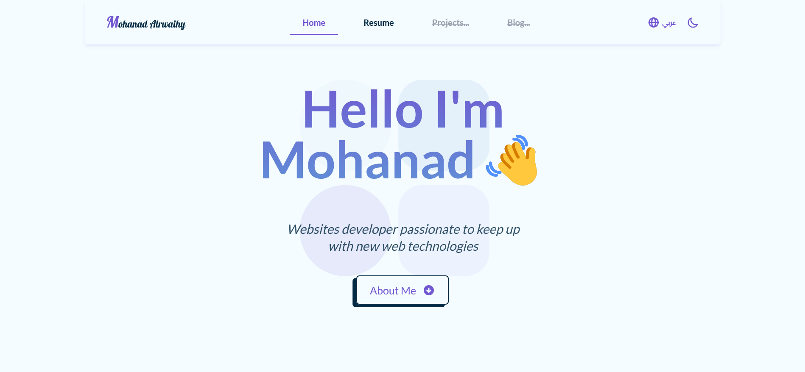
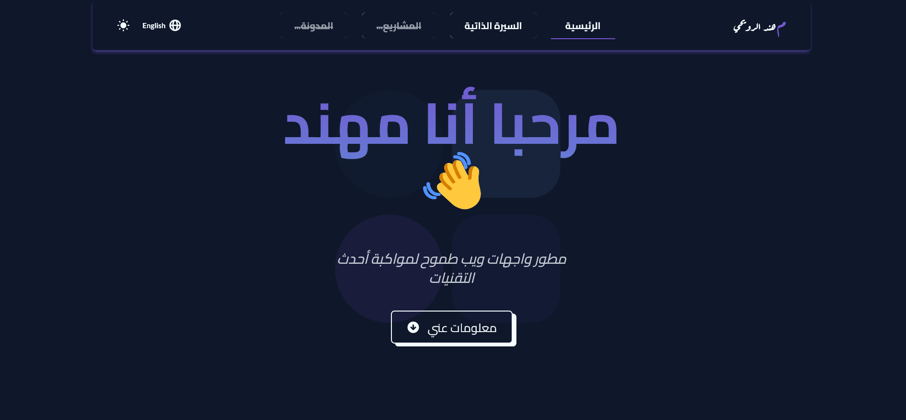

# Portfolio | Personal Website

Welcome to my personal website built with **React** and styled with the fantastic utility CSS framework **Tailwind CSS**.

I work on my portfolio from time to time and add new sections, pages, apply and upgrade my website to use more advanced tools.

## Screenshots

## Built with

- [React](https://reactjs.org/) - JS library
- [Tailwind CSS](https://tailwindcss.com/) - CSS framework
- [Framer Motion](https://www.framer.com/motion/) - Animation Library for React
- [i18next](https://www.i18next.com/) - i18next is an **internationalization-framework** written in and for JavaScript.
- [React Icons](https://react-icons.github.io/react-icons/) - React icons provides a huge collections of icons from different sources.
- [Sanity](https://www.sanity.io/) - Sanity is a customizable solution that treats content as data to power your digital business.

## Author

- Twitter - [@MohanadOO\_](https://twitter.com/MohanadOO_)
- Linkedin - [Mohanad Alrwaihy](https://www.linkedin.com/in/mohanad-alrwahiy-176aa719b/)
